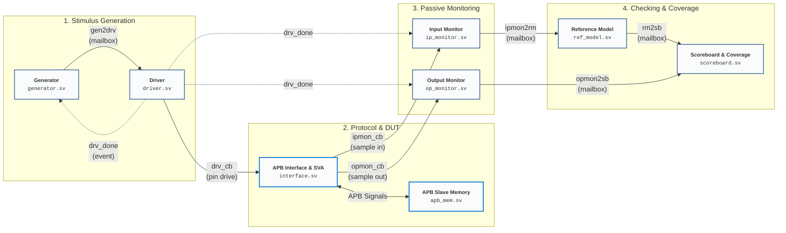

# AMBA 3 APB Protocol Verification Environment

A layered, constrained-random SystemVerilog verification environment with a reference model, functional coverage, and protocol assertions for verifying an **AMBA 3 APB (Advanced Peripheral Bus)** slave memory module.

---

## Architecture Overview

The testbench follows a modular, 4-stage layered verification architecture with clean feed-forward dataflow:



---

## File Structure & Descriptions

All SystemVerilog testbench components and design files are located in the `APB_SV/` directory:

| File | Component / Type | Description |
| :--- | :--- | :--- |
| [`APB_SV/apb_mem.sv`](APB_SV/apb_mem.sv) | **DUT (Design Under Test)** | Parameterized APB Slave Memory (`32x32-bit`). Implements APB FSM (`IDLE`, `SETUP`, `ACCESS`), variable wait states via randomized `PREADY` delay, out-of-bounds address error, invalid data detection, and unwritten read detection with `PSLVERR`. |
| [`APB_SV/interface.sv`](APB_SV/interface.sv) | **Interface & Assertions** | Declares APB bus signals, clocking blocks (`drv_cb`, `ipmon_cb`, `opmon_cb`), modports (`DRV`, `IPMON`, `OPMON`), and Concurrent SystemVerilog Assertions (SVA) verifying protocol compliance. |
| [`APB_SV/transaction.sv`](APB_SV/transaction.sv) | **Transaction Class** | Models APB transfer items (`PADDR`, `PWDATA`, `PRDATA`, `PWRITE`, `PRESETn`, `PSLVERR`). Includes dynamic arrays for multi-transfer packets, random constraints, distribution weights, error case toggles, and compare methods. |
| [`APB_SV/generator.sv`](APB_SV/generator.sv) | **Generator** | Generates randomized transaction items. Starts with an initial reset transaction, randomizes subsequent packets, synchronizes with the driver via `@(drv_done)`, and pushes packets to `gen2drv`. |
| [`APB_SV/driver.sv`](APB_SV/driver.sv) | **Driver** | Translates transaction objects into pin-level APB bus cycles across `idle()`, `setup()`, and `access()` states. Honors wait states (`PREADY`) and emits `->drv_done` upon packet completion. |
| [`APB_SV/ip_monitor.sv`](APB_SV/ip_monitor.sv) | **Input Monitor** | Passively samples master-driven signals (`PSEL1`, `PWRITE`, `PADDR`, `PWDATA`, `PRESETn`) during `PENABLE` phase, reconstructs packet data, and forwards it to the Reference Model via `ipmon2rm`. |
| [`APB_SV/op_monitor.sv`](APB_SV/op_monitor.sv) | **Output Monitor** | Passively samples slave responses (`PRDATA`, `PREADY`, `PSLVERR`) when `PENABLE && PREADY`, reconstructs output packets, and sends them to the Scoreboard via `opmon2sb`. |
| [`APB_SV/ref_model.sv`](APB_SV/ref_model.sv) | **Reference Model** | Golden software model of the APB memory. Predicts expected responses (`PRDATA`, `PSLVERR`, `PREADY`) for valid writes/reads, reset state, invalid data (X/Z), and out-of-bound addresses, forwarding golden packets to `rm2sb`. |
| [`APB_SV/scoreboard.sv`](APB_SV/scoreboard.sv) | **Scoreboard & Coverage** | Compares DUT outputs (`opmon2sb`) with golden outputs (`rm2sb`). Samples functional coverage (`covergroup apb_cg`), computes feature-wise pass/fail stats, writes `log.txt`, and triggers `TEST_DONE`. |
| [`APB_SV/environment.sv`](APB_SV/environment.sv) | **Environment** | Encapsulates and instantiates all verification components, connects mailboxes and events, and manages the simulation lifecycle (`build()`, `start()`, `stop()`, `run()`). |
| [`APB_SV/test.sv`](APB_SV/test.sv) | **Test Top Class** | Configures test parameters (e.g. `no_of_testcases = 800`), instantiates the environment, and provides child transaction classes (`write_transaction`, `read_transaction`) for directed tests. |
| [`APB_SV/tb_top.sv`](APB_SV/tb_top.sv) | **Top-level Testbench** | Top module instantiating the free-running clock generator, physical interface (`APB_intf`), DUT (`apb_mem`), and invokes the test class execution. |
| [`APB_SV/apb_package.svh`](APB_SV/apb_package.svh) | **Package Include Header** | Includes all testbench component source files in dependency order. |
| [`APB_SV/run_do.sv`](APB_SV/run_do.sv) | **Simulation Script** | ModelSim / QuestaSim macro command file for compiling, loading signals into waveform viewer, and executing simulation. |
| [`Makefile`](Makefile) | **Build Automation** | Root Makefile supporting QuestaSim/ModelSim, Synopsys VCS, and Cadence Xcelium with targets for compilation, batch simulation, GUI simulation, coverage, and cleanup. |

---

## Verification & Test Plan

### 1. Features Under Test

The testbench tags transactions with a Feature ID (`f_id`) to track test coverage across APB operations:

| Feature ID | Feature Name | Description |
| :---: | :--- | :--- |
| **1** | **Single Write Transfer** | Single write cycle to valid address with valid write data (`PWRITE = 1`, transfer size = 1). |
| **2** | **Multiple Write Transfers** | Back-to-back multiple write cycles within a single packet (`PWRITE = 1`, transfer size > 1). |
| **3** | **Single Read Transfer** | Single read cycle from previously written or unwritten memory location (`PWRITE = 0`, transfer size = 1). |
| **4** | **Multiple Read Transfers** | Back-to-back multiple read cycles within a single packet (`PWRITE = 0`, transfer size > 1). |
| **5** | **Reset Operation** | Active-low asynchronous reset assertion (`PRESETn = 0`), verifying memory clearing to default states (`32'hffffffff`) and output deassertion. |

---

### 2. Corner Cases & Error Injection

The transaction and reference model verify the following negative/corner conditions via `error_case` generation:

1. **Address Out of Bounds**:
   - Addresses where `PADDR >= 32` (`2**DEPTH`).
   - Expected Result: `PSLVERR = 1`, `PREADY = 1`, error logged.
2. **Invalid Write Data**:
   - `PWDATA` contains `X` or `Z` logic states.
   - Expected Result: `PSLVERR = 1`, write suppressed.
3. **Unwritten Memory Read**:
   - Reading from uninitialized/reset memory containing default `32'hffffffff`.
   - Expected Result: `PSLVERR = 1`.
4. **Variable Slave Wait States**:
   - DUT inserts randomized delay before asserting `PREADY`.
   - Verifies driver and monitors properly hold and sample signals across wait cycles.

---

### 3. Protocol Assertions (SVA)

Implemented inside [`APB_SV/interface.sv`](APB_SV/interface.sv):

- **`enable_ch`**: `PENABLE` must be asserted exactly 1 clock cycle after `PSEL1` assertion (`$rose(PSEL1) |=> PENABLE`).
- **`stable_ch`**: All address (`PADDR`), control (`PWRITE`, `PSEL1`), and data (`PWDATA`) signals must remain stable while `PENABLE` is asserted.
- **`enable_deassert_ch`**: `PENABLE` must be deasserted 1 cycle after `PREADY` is asserted.
- **`enable_deassert_ch2`**: `PENABLE` must not deassert unless `PREADY` is asserted.

---

### 4. Functional Coverage Model

The scoreboard instantiates `covergroup apb_cg` measuring:

- **Coverpoints**:
  - `PSEL1`: Select line values (`0`, `1`).
  - `PWRITE`: Read vs Write transfers (`0`, `1`).
  - `PWDATA`: Write data values divided across 16 bins across `[0:32'hffffffff]`.
  - `PADDR`: Valid address space `[0:31]`, with default illegal bin.
  - `PREADY`: Ready states (`0`, `1`).
  - `PRDATA`: Read data values divided across 16 bins.
  - `PSLVERR`: Slave error indicator (`0`, `1`).
- **Cross Coverage**:
  - `PSEL1 x PWRITE`: Read and write distributions when slave is selected.
  - `PSEL1 x PWRITE x PADDR`: Addressed read/write operations across memory locations.

---

## How to Run Simulation

You can run the simulation using the provided [`Makefile`](Makefile).

### Targets

```bash
# 1. Compile & run batch simulation with QuestaSim (default)
make

# 2. Compile only
make compile

# 3. Run simulation in batch mode
make sim

# 4. Open simulation in GUI mode with waveforms
make gui

# 5. Run simulation with coverage collection enabled
make cov

# 6. Clean build artifacts and simulation logs
make clean

# 7. Show all available targets and help
make help
```

### Multi-Simulator Support

To use Synopsys VCS or Cadence Xcelium:
```bash
make sim SIM=vcs
make sim SIM=xcelium
```

---

## Test Report Output

Upon completion of test execution, the Scoreboard outputs a test report to the terminal and [`log.txt`](log.txt):

```text
******************************* TEST REPORT ********************************
Total no of test cases: 800
Total no of passed test cases: 800
Failure rate: 0.00 %

Function coverage is: 88.89 % 

FEATURE WISE DETAILS
Feature id      Total Cases     Pass Cases      Fail Cases      Failure Rate
1               116             116             0               0.00 %
2               284             284             0               0.00 %
3               129             129             0               0.00 %
4               268             268             0               0.00 %
5               3               3               0               0.00 %
******************************************************************************
```
